# MACHINE LEARNING - STARS TYPE CLASSIFICATION PREDICTION

This project contain and use [Star Type Classification / NASA Dataset](https://www.kaggle.com/brsdincer/star-type-classification)
that is distributed under [Database Contents License (DbCL)](https://opendatacommons.org/licenses/dbcl/dbcl-10.txt).

## Wstęp

Projekt ma na celu dokonanie analizy, wizualizacji i stworzenie modelu dla zbioru danych. Używany zbiór danych zawiera
specyfikację gwiazd w tym ich typy.

### Podział zbioru danych

* Features:

    * Liczbowe:
        * Temperatura (K)
        * Jasność (L/Lo)
        * Promień (R/Ro)
        * Absolutna wielkość gwiazdowa (Mv)

    * Tekstowe:
        * Kolor
        * Klasa wydmowa

* Target:
    * Typ gwiazdy

### Jednostki

Lo = _3.828 x 10^26 W_ – jasność Słońca

Ro = _6.9551 x 10^8 m_ – promień Słońca

## Wizualizacja zbioru

### Intro

Rozpoczynamy poprzez pokazanie zależności pomiędzy parametrami. ScatterMatrix pokazujący jak zależą od siebie wartości.

### Wartości liczbowe — features

__1. Temperatura__

Rozkład temperatury (boxplot) pokazuje, że najwięcej gwiazd ma temperaturę z zakresu 4000K - 15000K. Mediana to ok
6000K. Niektóre gwiazdy mają jednak temperatury sięgające znacznie więcej.

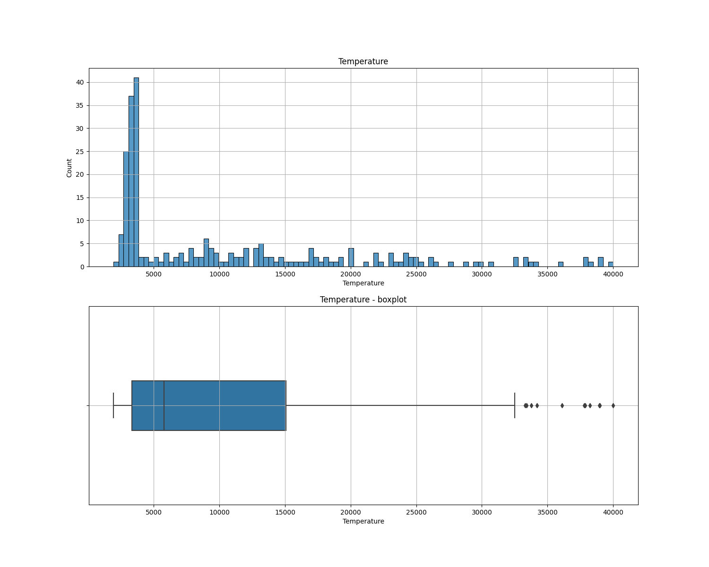

__2. Jasność__

Światłość waha się bardziej niż temperatura, dlatego należy podawać ją logarytmicznie. Mediana jest mniejsza od
wielkości naszego Słońca.

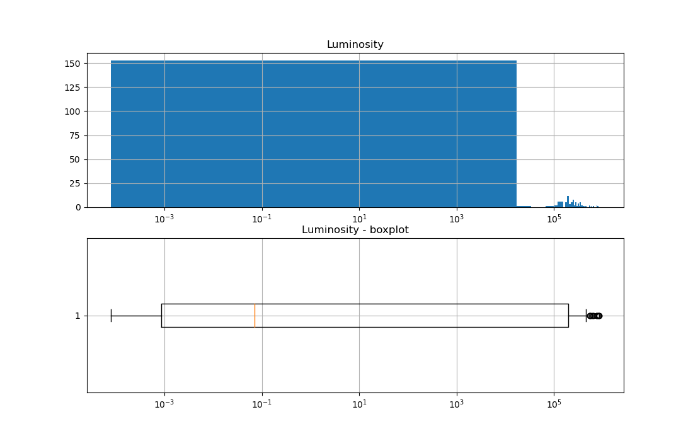

__3. Promień__

Promienie tak samo, jak jasność należy pokazywać logarytmicznie z uwagi na duży rozrzut. Średni promień gwiazdy jest w
przybliżeniu równy Promieniowi naszego słońca. Większość gwiazd jest 100 razy większa lub mniejsza, lecz są też gwiazdy
mocno oddalone od średniej na wykresie.

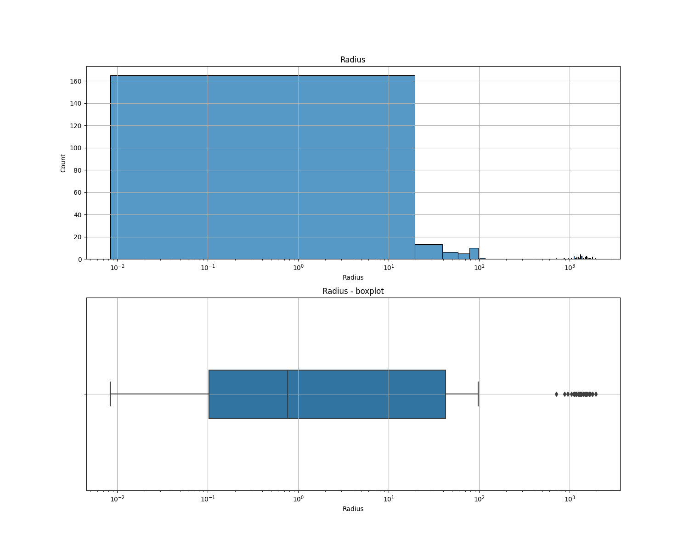

__4. Absolutna wielkość gwiazdowa__

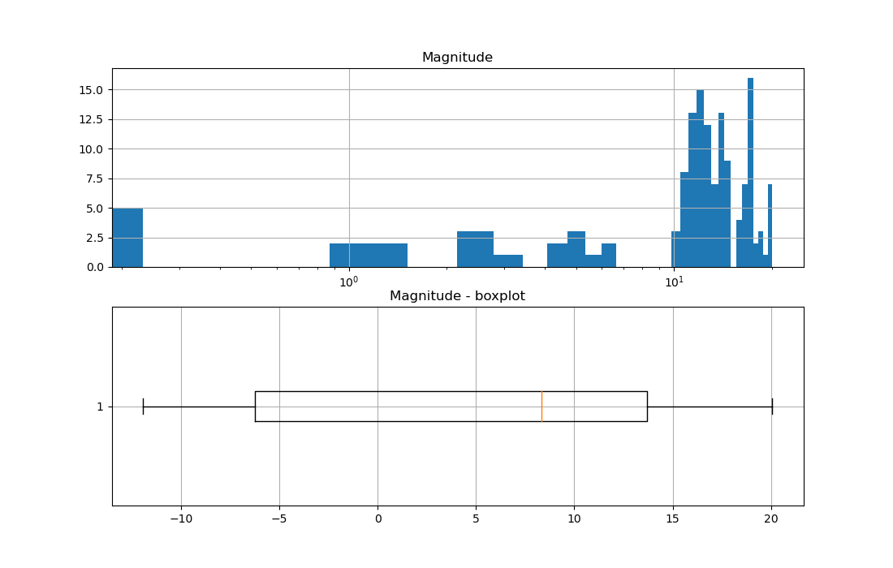

### Wartości kategoryczne — features

__5. Kolor__

W kolorze przeważa czerwony (połowa wszystkich gwiazd ze zbioru jest tego koloru). Znaczący udział w kolorach biorą
Czerwony, Niebieski oraz Biały (najczęściej gwiazda będzie miała jeden z tych lub ich mieszankę).

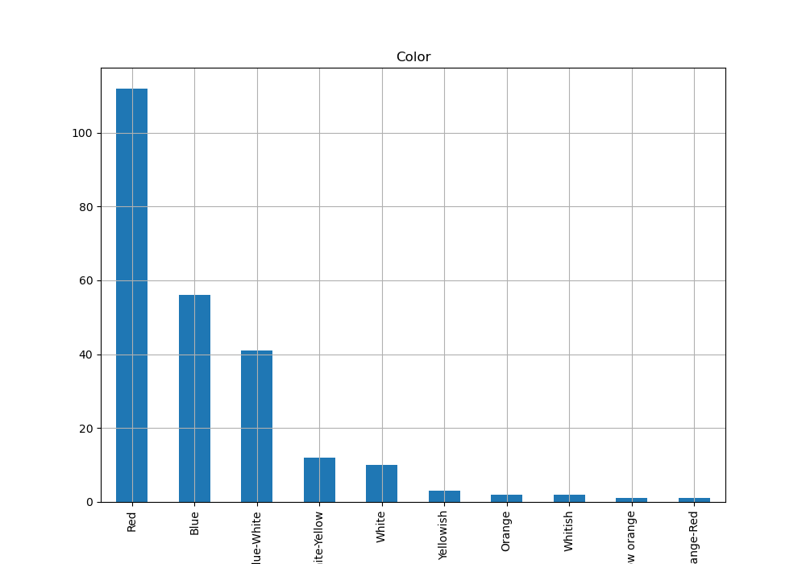

__6. Klasa widmowa ([info](https://en.wikipedia.org/wiki/Asteroid_spectral_types))__

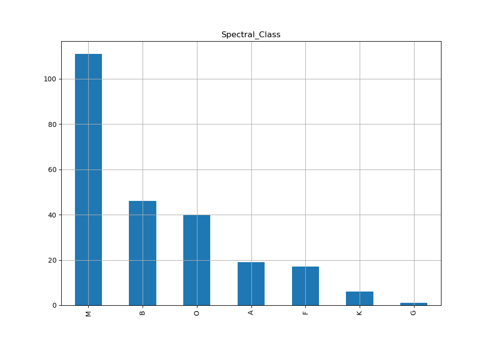

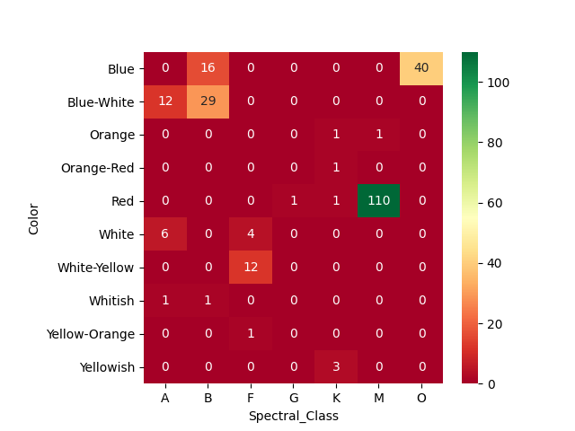
## Zależności danych w zbiorze danych

### Korelacje

Wykresy korelacji pokazują, że najbardziej zależne są Promień-Jasność oraz Temperatura-Jasność, dlatego warto zobaczyć
wykresy Typu gwiazdy od tych 2 zestawów.

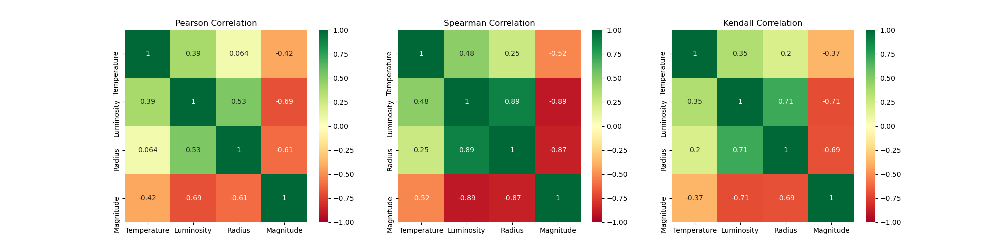

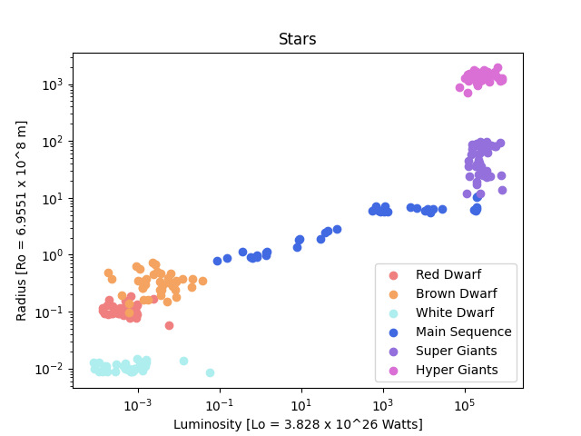

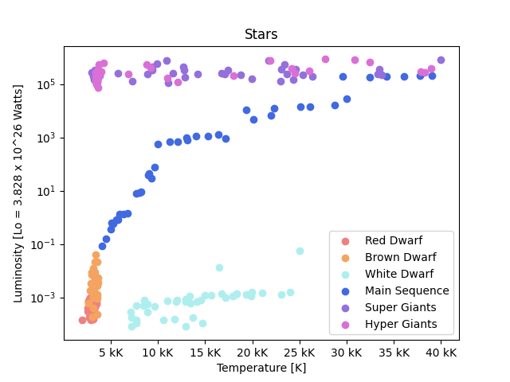

Wykres Jasności od Temperatury jest właśnie dlatego dosyć popularny, aby pokazać jak dzielą się gwiazdy ze względu na te
dwa typy.

### PCA

#### 2D

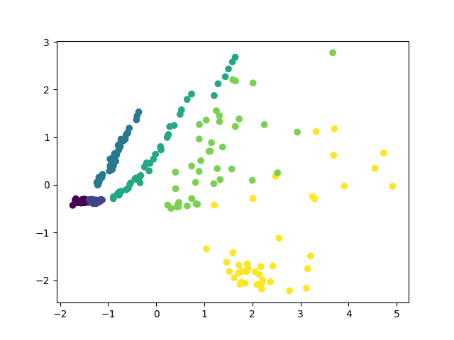

#### 3D

## Modele uczące

### SVC - Support Vector Classification

SVC wykorzystuje różne jądra. Na wykresach przedstawiono zależności skuteczności od parametru 'c' (linear nie wykorzystuje parametru 'c').

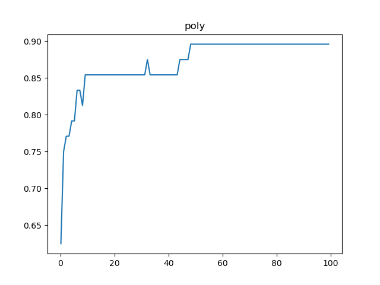

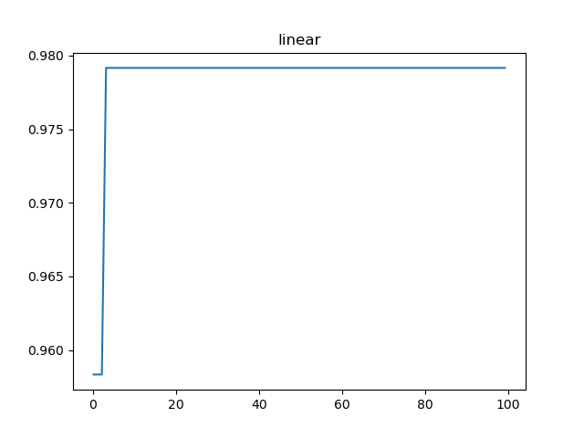

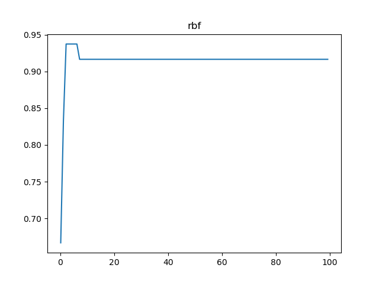

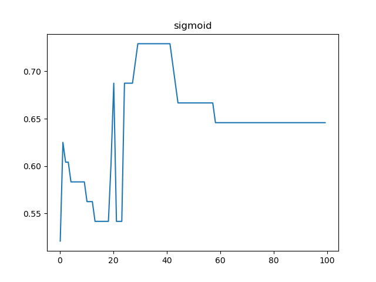

Jak widać na wykresie najlepiej sprawdza się liniowe jądro.

Model SVC osiąga zazwyczaj powyżej __80%__ skuteczności predykcji, a w przypadku naszego zbioru danych osiąga nawet __100%__.

### GNB - Gaussian Naive Bayes

Model sprawował się najgorzej z trójki, chociaż w niektórych przypadkach osiągał __100%__.

### KNN - K-nearest neighbors

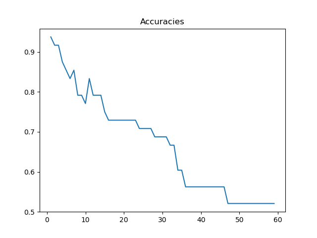

Wykres przedstawia zależność skuteczności predykcji od liczby sąsiadów.

Początkowo przy nieoczyszczonych danych (przed użyciem StandardScaler'a) model ten osiągał około __60%__ skuteczności.
Po przygotowaniu danych przyjaznych dla predykcji model ten jest skuteczny na równi z SVC.
Z wykresu widać im mniejsza liczba sąsiadów tym lepiej — jeden działa najlepiej 😄.

### RFC - Random Forest Classifier

Model dorównuje KNN jednak mocno zależy od parametru `n_estimators`, który przy coraz większych wartościach potrzebuje więcej czasu na uczenie się.

### DTC - Decision Tree Classifier

DTC ma bardzo podobne wyniki jak RFC. W przypadku uczenia się na bardzo małej ilości zbioru danych,
osiąga wraz z RFC bardzo dobre wyniki.

 

Każdy model wyszkolony na pełnym zbiorze danych jest zapisywany odpowiednio do pliku `model-name.mdl`

## License

Copyright (c) ML-GroupB. All rights reserved.

Licensed under [MIT](./LICENSE) license.